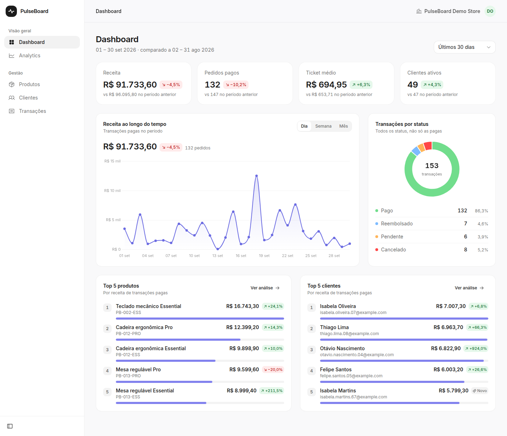
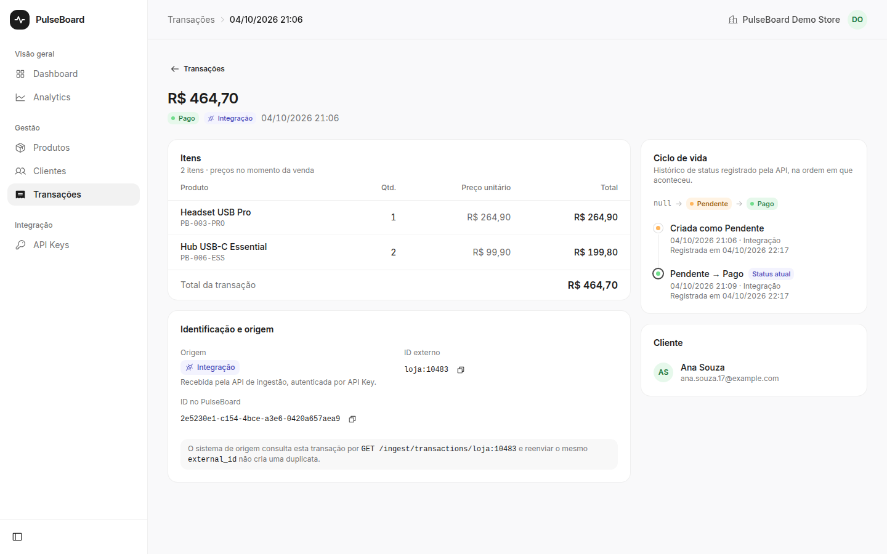
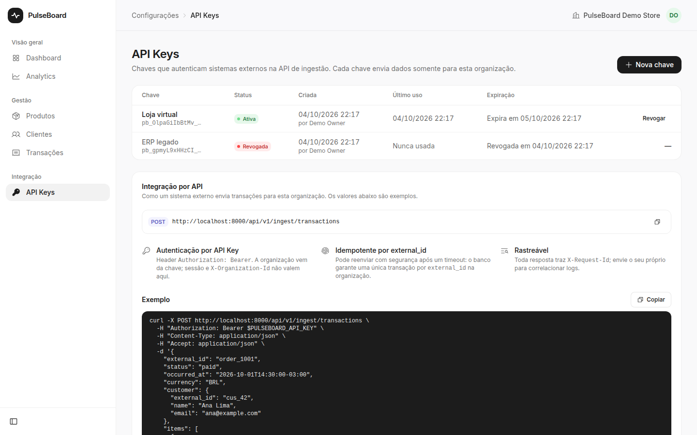
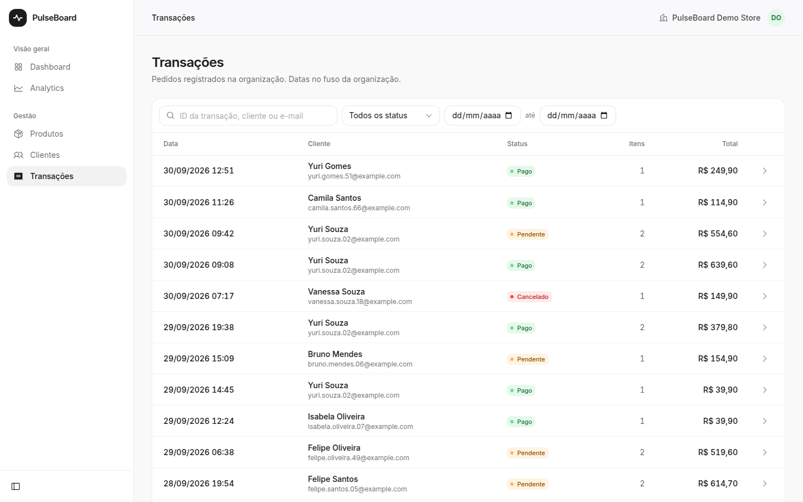
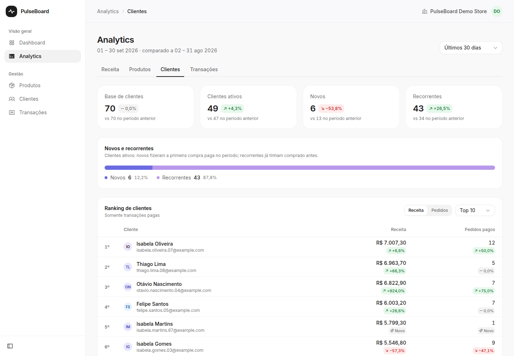
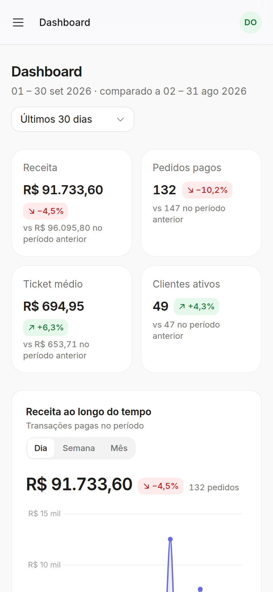

# PulseBoard

**SaaS multi-tenant de gestão comercial e analytics.** Sistemas externos enviam vendas por uma API de ingestão autenticada por API Key, idempotente e com ciclo de vida de status explícito; o PulseBoard transforma essas transações em dashboard e métricas calculados no backend, no fuso horário de cada organização.

[](https://github.com/Henriqueverri/pulseboard/actions/workflows/ci.yml)
[](https://app.henriqueverri.dev)
[](LICENSE)

- **Em produção:** [app.henriqueverri.dev](https://app.henriqueverri.dev) (SPA) e `api.henriqueverri.dev` (API), com deploy contínuo a partir da `main`.
- **Stack:** Nuxt 4 · Vue 3 · TypeScript · Laravel 12 · PHP 8.4 · PostgreSQL 16 · app mobile em Expo / React Native.
- **Documentação técnica:** [integração](docs/integration.md) · [arquitetura](docs/architecture.md) · [API](docs/api.md) · [testes](docs/testing.md) · [deploy](docs/deployment.md).



## Demo

**[app.henriqueverri.dev](https://app.henriqueverri.dev)** — demo pública, com contas compartilhadas:

| Conta | E-mail | Senha |
|-------|--------|-------|
| Owner (acesso completo, inclusive exclusão) | `demo@example.com` | `PulseBoardDemo2026!` |
| Member (sem permissão de exclusão) | `demo-member@example.com` | `PulseBoardDemo2026!` |

O que dá para explorar: dashboard com comparação ao período anterior, as quatro abas de analytics (receita, produtos, clientes e status), CRUD de produtos e clientes, transações com origem e linha do tempo de status, gestão de API Keys, e a diferença de permissões entre owner e member.

- A API roda no plano gratuito do Render: **o primeiro acesso depois de um período ocioso pode levar até ~1 minuto** enquanto o container sobe.
- A organização de demo tem 40 produtos, 70 clientes e ~6 meses de vendas, completadas até o dia atual sempre que a API sobe. Dados criados ou excluídos por visitantes podem ser restaurados ao estado original.

### Testando a API de ingestão na demo

Nenhuma API Key é publicada neste repositório nem na demo: cada pessoa cria a sua.

1. Entre com a conta **owner** acima e abra **Integração → API Keys**.
2. Clique em **Nova chave** e copie o valor na janela seguinte: ele aparece uma única vez. Na organização de demo, **toda chave expira em 24 horas**.
3. Envie uma venda seguindo o [guia de integração](docs/integration.md#3-envie-uma-transação) com `PULSEBOARD_API_URL=https://api.henriqueverri.dev/api/v1`, usando um SKU do catálogo (por exemplo, `PB-001-ESS`).
4. Veja a venda em **Transações**, com origem "Integração" e a linha do tempo de status, e revogue a chave ao terminar.

A demo é compartilhada e aceita no máximo 10 chaves ativas. Se a criação falhar por esse limite, revogue uma chave antiga na mesma tela: todas expiram em 24 horas de qualquer forma.

| Transação com ciclo de vida | API Keys | Transações |
|---|---|---|
|  |  |  |

| Analytics de clientes | Mobile |
|---|---|
|  |  |

## O que é o PulseBoard

Uma aplicação para acompanhar a operação comercial de um negócio: *quanto vendi neste período comparado ao anterior, quais produtos puxam a receita, quantos clientes voltaram a comprar*. O domínio implementado:

- **Organizações e papéis** — o cadastro cria o usuário, a organização e a membership `owner`; `owner` e `member` têm permissões diferentes, aplicadas pela API.
- **Produtos e clientes** — CRUD com busca, detalhe com métricas de venda, ID externo para a integração e exclusão que preserva o histórico (soft delete quando há vendas).
- **Integração por API** — sistemas externos registram vendas e mudanças de status com API Keys da organização, criadas e revogadas pelos owners.
- **Transações** — histórico de vendas com itens, preço no momento da venda, origem (demo ou integração) e linha do tempo de status; na UI é somente leitura.
- **Dashboard e analytics** — receita, pedidos, ticket médio e clientes (ativos, novos e recorrentes), receita por dia/semana/mês, rankings e distribuição por status, sempre com o período anterior ao lado.
- **Estado na URL** — período, filtros, ordenação e paginação ficam na query string: links compartilháveis, voltar/avançar funcionam.

## Destaques técnicos

### Ingestão de transações

`POST /api/v1/ingest/transactions`, uma venda por requisição, síncrono. O integrador recebe na hora 201 (criada), 200 (reenvio idêntico) ou um erro com `code` estável. Guia completo, com exemplos executados e script de retry: [`docs/integration.md`](docs/integration.md).

- **API Key própria, não Sanctum nem JWT:** chave opaca `pb_<prefixo>_<segredo>` com lookup no banco (revogação instantânea e `last_used_at`), guardada só como SHA-256 e exibida uma única vez. O token do Sanctum seria aceito pelas rotas internas; JWT não se revoga sem denylist.
- **Idempotência garantida pelo banco:** `UNIQUE (organization_id, external_id)` e insert-first. Retry e corrida caem no mesmo caminho (a violação da unique), e um fingerprint do payload separa o replay (200) do conflito (409). Provado com requisições concorrentes reais no PostgreSQL.
- **Ciclo de vida explícito:** `pending → paid → refunded` e `pending → canceled`, validado no enum e aplicado com lock de linha num único service. O status atual fica denormalizado para o analytics, e cada mudança entra num histórico protegido por `UNIQUE (transaction_id, to_status)`.
- **Tenant pela chave:** a ingestão ignora `X-Organization-Id`; a chave registra o mesmo contexto de organização da API interna, então todo o código escopado é reaproveitado. Recurso de outra organização é indistinguível de inexistente.
- **Do sistema externo ao dashboard:** a venda ingerida entra na mesma tabela e nos mesmos scopes, e os KPIs mudam na próxima leitura (coberto por teste end-to-end).
- **Operável:** `X-Request-Id` em toda resposta e em toda linha de log, logs JSON com `outcome` e `code` por requisição (nunca a chave nem dados pessoais), rate limit de 120 req/min por chave e número fixo de queries por criação, independente do número de itens.

### Multi-tenancy

Banco compartilhado com `organization_id` em toda tabela de domínio. O header `X-Organization-Id` **seleciona o contexto, mas não autoriza sozinho**: o middleware `EnsureOrganizationContext` valida a membership a cada requisição e registra a organização atual no container.

| Camada | Garantia | Resposta |
|--------|----------|----------|
| Sessão Sanctum | usuário autenticado | 401 |
| Middleware | usuário é membro da organização do header | 403 |
| Route model binding (`BelongsToOrganization`) | recurso pertence à organização atual | 404 (não revela existência) |
| Form Requests | `organization_id` no payload ou na query é proibido — o tenant nunca vem do cliente | 422 |
| Models | transação não referencia cliente, nem item referencia produto, de outra organização | exceção |
| Policies | papel (`owner` / `member`), por exemplo só `owner` exclui ou cria API Keys | 403 |

Na API de ingestão, a organização vem exclusivamente da API Key. Testes dedicados (`ApiTenantIsolationTest`, `AnalyticsTenantIsolationTest`, `TenantIsolationTest`, `IngestTenantIsolationTest`) verificam que dados de outra organização não aparecem em listagens **nem alteram números agregados**.

### Autenticação e segurança

- **Sanctum SPA:** sessão em cookie `httpOnly`, `Secure`, `SameSite=Lax`; CSRF via `XSRF-TOKEN` / `X-XSRF-TOKEN`, com retry automático em 419. Nenhuma credencial em `localStorage` ou `sessionStorage`; o Pinia guarda só o estado de UI.
- **Consequência assumida:** front e API precisam estar no mesmo site (`app.` e `api.` sob `henriqueverri.dev`), porque os domínios padrão das plataformas estão na Public Suffix List.
- CORS restrito à origem exata do front; rate limit de 6 req/min em login e cadastro; `TRUSTED_PROXIES` para que o rate limit use o IP real atrás do proxy do Render (coberto por teste).
- Erros de `api/*` sempre em JSON sem expor classes internas; `?redirect=` pós-login aceita apenas caminhos internos; front com `X-Frame-Options: DENY` e `frame-ancestors 'none'`.
- **API Keys tratadas como segredo:** só o hash fica no banco; o texto puro aparece numa única resposta (`Cache-Control: no-store`) e o front o mantém só na memória do diálogo. Qualquer falha de autenticação recebe o mesmo 401, o motivo real vai só para o log, e o Bearer da integração não autentica as rotas internas.

### Analytics e consistência de dados

- **Tudo agregado em SQL no backend**, um service por endpoint; o front não recalcula nada. Revenue, Products e Customers reutilizam os KPIs do `DashboardService`, então o resumo de cada tela é o mesmo número do dashboard por construção.
- **Uma definição de venda** (transações `paid`), com a distribuição por status como exceção documentada.
- **Período anterior de mesma duração** em todas as métricas (`value`, `previous`, `change`), lido na mesma varredura do período atual.
- **Dinheiro como string decimal** na API (`"1250.00"`), nunca float.
- **Número fixo de consultas por endpoint** (de 1 a 4), independente de volume, período ou granularidade — travado por `AnalyticsQueryBudgetTest`.
- **Consistência entre endpoints testada:** receita do dashboard = soma da série temporal = soma do ranking completo de produtos = linha `paid` da distribuição por status; pedidos batem com a listagem de transações.
- **Performance medida** com `EXPLAIN ANALYZE` sobre 200 mil transações: ~2–45 ms por consulta em 30 dias, até ~300 ms em 366 dias. Um índice composto candidato foi medido e descartado por não trazer ganho material ([detalhes](docs/architecture.md#performance)).

### Timezone

O banco guarda UTC; o calendário de negócio é o fuso IANA da organização (`organizations.timezone`) e o cliente nunca escolhe a timezone. Os limites de período são calculados na aplicação e convertidos para UTC; os buckets de dia, semana ISO e mês são agrupados no fuso local pelo PostgreSQL (`AT TIME ZONE`), com horário de verão correto — testado na CI. Uma venda em `2026-09-01T02:59:59Z` pertence a 31/08 em `America/Sao_Paulo`, e o front calcula "hoje" e os presets no mesmo fuso.

### Testes

| Suíte | Ferramenta | O que cobre |
|-------|-----------|-------------|
| API | PHPUnit — 608 testes | Auth, isolamento entre organizações, CRUD e regras de exclusão, analytics com dados controlados e sobre o dataset de demo, orçamento de consultas, timezone e horário de verão, API Keys, ingestão (validação, idempotência, lifecycle, concorrência real, orçamento de queries, logs), trusted proxies, comandos de release e demo |
| Web | Vitest + @nuxt/test-utils — 195 testes | Utilitários (dinheiro, datas, períodos, erros), `useApiClient` (CSRF, 419, 401, `Retry-After`, `X-Request-Id`), store de sessão, composables e páginas com fixtures no formato real da API, linha do tempo de status e o segredo da API Key exibido uma única vez |
| Mobile | Jest (`jest-expo`) + Testing Library + MSW — 78 testes | Client HTTP (Bearer, `X-Organization-Id`, 401/403, `Retry-After`, `X-Request-Id`), SecureStore, datas e períodos no timezone da organização (inclusive horário de verão), e fluxos com Expo Router: login, restauração e expiração da sessão, troca de organização, dashboard e transações (paginação, filtros, detalhe e linha do tempo) |
| E2E | Playwright + axe | Smoke do fluxo principal e fluxo de integração (criar chave na UI → ingerir → achar pelo ID externo → revogar → 401), contra o build de produção e um PostgreSQL descartável |

Localmente a suíte da API roda em SQLite (10 testes de horário de verão e de concorrência ficam de fora); na CI roda inteira em PostgreSQL. Como rodar: [`docs/testing.md`](docs/testing.md).

### CI/CD e deploy

[GitHub Actions](.github/workflows/ci.yml) em push na `main` e em pull requests:

- **`api`** — Pint, migrations em PostgreSQL 16 limpo, PHPUnit completo em PostgreSQL;
- **`web`** — ESLint, typecheck (`vue-tsc`), Vitest e build estático;
- **`mobile`** — ESLint, typecheck, Jest e bundle Android (Hermes) com `expo export`;
- **`e2e`** — só depois dos dois anteriores: PostgreSQL + API com dados de demo (senha aleatória por execução, mascarada nos logs) + build estático + Playwright; traces como artefato em caso de falha.

Publicação pelas integrações nativas das plataformas:

- **Frontend → Cloudflare Pages:** build estático a cada push na `main`.
- **API → Render (Docker, Nginx + PHP-FPM):** publicada **só depois que os checks da CI passam** e só quando `apps/api/**` muda. No start, o container roda as migrations e a sincronização da demo sob advisory lock do PostgreSQL; se algo falhar, ele não aceita tráfego e a versão anterior continua no ar. Health check em `/api/v1/health` verifica também o banco.
- **Banco → Supabase PostgreSQL:** Session pooler com TLS.

## Arquitetura

```text
Navegador                                   Sistema externo (loja, ERP)
   │                                              │
   ▼                                              │  POST /ingest/* · Bearer API Key
Nuxt 4 SPA estática ──── Cloudflare Pages         │  sem sessão, sem X-Organization-Id
   página → composable → repository               │
   → useApiClient                                 │
   │                                              │
   │  REST + cookie de sessão (Sanctum SPA,       │
   │  CSRF) + X-Organization-Id                   │
   ▼                                              ▼
API Laravel 12 ──────────────────── Render · Docker · api.henriqueverri.dev
   interna:   middleware de tenant → Form Request → Controller (fino)
                → Policy → Service (agregações SQL) → API Resource
   ingestão:  AuthenticateApiKey (tenant pela chave) → rate limit por chave
                → Form Request → TransactionIngestionService / TransactionLifecycle
   │
   ▼
PostgreSQL ──────────────────────── Supabase
```

- **Monorepo com dois apps independentes** (`apps/web`, `apps/api`), sem código compartilhado e com deploys separados.
- **Backend:** controllers finos; validação em Form Requests; autorização em Policies; regras de analytics em services (`app/Services/Analytics`) apoiados por value objects (`ReportingPeriod`, `Comparison`, `Money`); serialização em API Resources. Não há camada de repository no backend: os services consultam via Eloquent e query builder a partir da organização do contexto.
- **Frontend:** nenhum componente faz HTTP direto — o acesso passa por repositories e pelo `useApiClient`, que centraliza credenciais, header de organização, CSRF e normalização de erros. Pinia só para a sessão; dados de tela via `useAsyncData` com chave por organização.

Modelo de dados, alternativas consideradas e limitações conhecidas: [`docs/architecture.md`](docs/architecture.md).

## Decisões técnicas

| Decisão | Por quê | Trade-off |
|---------|---------|-----------|
| **Sanctum SPA com cookie httpOnly** | Credencial fora do alcance de JavaScript (mitiga roubo por XSS), CSRF nativo, sem BFF extra | Front e API precisam compartilhar o domínio registrável; previews do Pages não autenticam |
| **Nuxt como SPA estática** (`ssr: false`) | A sessão é um cookie da API; SSR não agregaria valor e exigiria um servidor Node. O build vai para uma CDN | Sem renderização no servidor (irrelevante para uma área autenticada) |
| **Multi-tenancy por `organization_id`** em banco compartilhado | Simples de operar; isolamento garantido em camadas e coberto por testes | Isolamento depende da aplicação, não do banco (sem schema por tenant nem RLS) |
| **Analytics agregadas no backend** | Uma definição de métrica para todas as telas; o front só apresenta | Cada requisição consulta o banco (sem cache) |
| **Timezone da organização** como calendário de negócio | "Hoje" e "este mês" dependem de onde o negócio está, não do servidor | Um membro em outro fuso vê datas e horários no calendário do negócio, não no seu |
| **PostgreSQL** | `AT TIME ZONE` com base de timezones, advisory locks para o release e `EXPLAIN ANALYZE` para medir | A suíte local usa SQLite por velocidade; só a CI, em PostgreSQL, cobre o comportamento de timezone por completo |
| **API Key opaca com hash SHA-256** | Revogação instantânea e `last_used_at`; o segredo tem ~238 bits, então um hash lento não protegeria nada e custaria latência em toda requisição | Uma consulta ao banco por requisição de ingestão |
| **Idempotência pelo `external_id`** com unique constraint | A venda tem uma chave natural; o banco é a fonte da verdade, inclusive na corrida | Integrador com várias origens precisa usar namespaces nos IDs |
| **Ingestão síncrona, uma venda por requisição** | O integrador precisa do 201/200/409 para decidir o retry; leva milissegundos | Volume alto vira N requisições sob o rate limit; lote e async ficam para quando houver CSV ou batch |
| **Status atual denormalizado + histórico** | Leitura barata para o analytics e trilha completa para auditoria e UI | O analytics ainda usa o status atual: um estorno posterior muda o período da venda original |
| **Transações somente leitura na API interna** | A escrita vem só da integração, com idempotência e lifecycle; a UI é para gestão e análise | Corrigir uma venda é mudar o status pela integração, não editar |
| **Sem Redis, filas ou workers** | Nada é assíncrono hoje; sessão, cache e rate limit no banco mantêm a infra mínima | O rate limiter em banco faz escritas extras; Redis passaria a se justificar com volume |
| **Cloudflare Pages + Render + Supabase** | Front estático em CDN, API em container Docker reproduzível, PostgreSQL gerenciado; deploy da API condicionado à CI | Planos gratuitos: cold start da API, banco pausa sem uso, um único ambiente |
| **Playwright contra o build de produção** | Valida o artefato que vai para o Pages, com API e PostgreSQL reais | Um único smoke do fluxo principal, não uma suíte E2E extensa |

## Stack

| Área | Tecnologias |
|------|-------------|
| Frontend | Nuxt 4 (SPA), Vue 3, TypeScript, Pinia, Tailwind CSS, reka-ui, Chart.js |
| Backend | Laravel 12, PHP 8.4, Laravel Sanctum |
| Banco e infraestrutura | PostgreSQL 16, Supabase, Render (Docker: Nginx + PHP-FPM), Cloudflare Pages, GitHub Actions |
| Mobile | Expo SDK 57, React Native, Expo Router, TanStack Query, expo-secure-store, react-native-gifted-charts |
| Testes e qualidade | PHPUnit, Vitest + @nuxt/test-utils, Playwright, Laravel Pint, ESLint, `vue-tsc` |

## Documentação

| Documento | Conteúdo |
|-----------|----------|
| [Integração](docs/integration.md) | Para quem integra: API Key, payload, respostas e `code`, idempotência, script de retry, reconciliação, mudanças de status e limites, com exemplos executados |
| [Arquitetura](docs/architecture.md) | Modelo de dados, autenticação, multi-tenancy, ingestão (chave, idempotência, lifecycle, síncrono vs. async), analytics, performance, timezone, frontend e limitações conhecidas |
| [API](docs/api.md) | Contratos REST: autenticação, CRUD, transações, API Keys, resumo da ingestão e cada endpoint de analytics, com regras de consistência |
| [Testes](docs/testing.md) | Estratégia, o que cada suíte cobre e como rodar localmente e na CI |
| [Deploy](docs/deployment.md) | Topologia, Render, Supabase, Cloudflare Pages, variáveis de ambiente e operação da demo |

Cada app tem seu README: [`apps/api`](apps/api/README.md), [`apps/web`](apps/web/README.md) e [`apps/mobile`](apps/mobile/README.md).

## Rodando localmente

Pré-requisitos: PHP 8.4 com `pdo_pgsql`, Composer 2, bun e Docker.

```bash
docker compose up -d                                   # PostgreSQL

cd apps/api && cp .env.example .env && composer install
php artisan key:generate && php artisan migrate:fresh --seed
php artisan serve --port=8000                          # http://localhost:8000

cd apps/web && cp .env.example .env && bun install     # outro terminal, na raiz
bun run dev                                            # http://localhost:3000
```

Login local: `test@example.com` (owner) ou `member@example.com` (member), senha `password`. O front precisa rodar em `localhost:3000`, a origem liberada no CORS e no Sanctum.

App mobile (npm, Expo Go ou emulador Android), com a API ouvindo na rede:

```bash
cd apps/api && php artisan serve --host=0.0.0.0 --port=8000

cd apps/mobile && cp .env.example .env && npm install  # ajuste EXPO_PUBLIC_API_URL
npm start
```

O app usa Personal Access Tokens do Sanctum (`POST /api/v1/auth/tokens`), não a sessão por cookie da SPA. Detalhes em [`apps/mobile/README.md`](apps/mobile/README.md).

## Escopo: portfólio, construído como produto

O PulseBoard é um projeto de portfólio. Não há empresa nem clientes reais por trás dele; o objetivo é mostrar, de ponta a ponta, como eu projeto, implemento, testo e coloco no ar um SaaS — com as mesmas preocupações de um produto real: isolamento entre tenants, autenticação segura, métricas consistentes, testes e deploy condicionado à CI.

O que é deliberadamente de demonstração:

- o histórico da demo vem de um gerador de dados; a API de ingestão é real, mas nenhuma loja de verdade está integrada a ela;
- cadastro aberto, conta owner da demo compartilhada (qualquer visitante pode criar chaves temporárias) e dados de demo restauráveis;
- planos gratuitos (cold start da API, banco que pausa sem uso) e um único ambiente, sem staging;
- interface só em pt-BR e moeda fixa em BRL.

## Próximos passos

Não implementados. Priorizados pelo que a arquitetura atual pediria primeiro para operar com tráfego real:

- **Analytics pelo histórico de status:** o histórico já é gravado; falta usá-lo para reconhecer estornos e cancelamentos na data em que ocorreram, sem alterar retroativamente o período da venda original.
- **Observabilidade:** hoje há logs JSON com `request_id` e um health check; faltam rastreamento de erros, métricas de latência por endpoint e alertas.
- **Rate limiting nas analytics:** login, cadastro e ingestão têm limite; analytics são os endpoints internos mais caros e ficariam atrás de um limite por usuário e organização.
- **Lote e processamento assíncrono na ingestão:** um endpoint de batch com semântica de falha parcial ou importação de CSV seria o gatilho para filas e workers (o driver de fila em banco já está configurado, sem worker).
- **Integração mais completa:** escopos por chave, assinatura HMAC das requisições e webhooks de saída.
- **Staging e backups gerenciados**, para validar migrations antes de produção.
- **Cache ou pré-agregação de analytics** para organizações grandes — o caminho indicado pelas medições, em vez de novos índices.
- **Gestão de membros e autorização mais granular:** convites e papéis além de `owner` / `member` (o modelo de membership já suporta múltiplas organizações por usuário).
- **Mais cobertura E2E** além do smoke e do fluxo de integração (permissões de member, troca de organização).

## Licença

[MIT](LICENSE)
