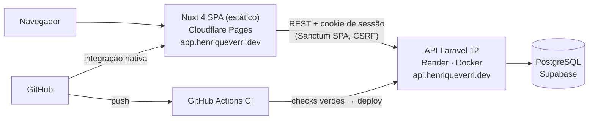

# PulseBoard

**SaaS multi-tenant de gestão comercial e métricas.** Produtos, clientes e vendas de uma organização num só lugar, com dashboard e analytics calculados no backend, no fuso horário da organização.

Projeto de portfólio full stack, construído de ponta a ponta — produto, API, frontend, testes, CI e deploy — para demonstrar como eu projeto e entrego uma aplicação SaaS completa.

[](https://github.com/Henriqueverri/pulseboard/actions/workflows/ci.yml)
[](https://app.henriqueverri.dev)


## Demo

**[app.henriqueverri.dev](https://app.henriqueverri.dev)**

| Conta | E-mail | Senha |
|-------|--------|-------|
| Owner (acesso completo, inclusive exclusão) | `demo@example.com` | `PulseBoardDemo2026!` |
| Member (sem permissão de exclusão) | `demo-member@example.com` | `PulseBoardDemo2026!` |

- A API roda no plano gratuito do Render: **o primeiro acesso depois de um período ocioso pode levar até ~1 minuto** enquanto o container sobe.
- A organização de demo tem 40 produtos, 70 clientes e ~6 meses de vendas, completadas até o dia atual sempre que a API sobe. Fique à vontade para criar, editar e excluir — a demo pode ser restaurada ao estado original.

| Analytics de clientes | Transações | Mobile |
|---|---|---|
|  |  |  |

## O problema

Pequenos negócios costumam acompanhar vendas em planilhas ou nos relatórios fragmentados de cada ferramenta. Perguntas simples — *quanto vendi este mês comparado ao anterior? quais produtos puxam a receita? quantos clientes voltaram a comprar?* — exigem trabalho manual e dão respostas diferentes dependendo de quem calcula.

O PulseBoard centraliza catálogo, clientes e transações por organização e responde essas perguntas com **definições únicas de métrica** (receita, pedidos, ticket médio, clientes ativos, novos e recorrentes), sempre comparadas ao período anterior e no calendário local do negócio.

**Para quem:** donos e gestores de pequenos comércios e lojas online que precisam de visibilidade comercial sem montar uma stack de BI.

## Funcionalidades

- **Dashboard** — receita, pedidos, ticket médio e clientes ativos com variação vs. período anterior; receita no tempo; distribuição por status; top 5 produtos e clientes.
- **Analytics** — receita por dia, semana ou mês; ranking de produtos (receita ou unidades); clientes novos vs. recorrentes e ranking; distribuição de transações por status.
- **Períodos** — presets (7 dias, 30 dias, 90 dias, 12 meses, mês atual, mês anterior) ou intervalo personalizado. Período, filtros, ordenação e paginação ficam na URL: links compartilháveis e voltar/avançar funcionam.
- **Produtos e clientes** — CRUD com busca e detalhe com métricas de venda; a exclusão preserva o histórico (soft delete quando há vendas).
- **Transações** — listagem somente leitura com filtros (status, cliente, período, busca) e detalhe com itens e preço no momento da venda.
- **Organizações e papéis** — o cadastro cria a organização; `owner` e `member` têm permissões diferentes, aplicadas pela API.
- **Acessibilidade e responsividade** — axe-core sem violações nas telas principais, navegação por teclado, layout de 360 px a desktop.

## Stack

| Camada | Tecnologias |
|--------|-------------|
| Frontend | Nuxt 4 (SPA), Vue 3, TypeScript, Pinia, Tailwind CSS, reka-ui, Chart.js |
| Backend | Laravel 12, PHP 8.4, Laravel Sanctum (SPA auth) |
| Banco | PostgreSQL 16 |
| Testes | PHPUnit, Vitest + @nuxt/test-utils, Playwright |
| Infra | GitHub Actions, Cloudflare Pages, Render (Docker: Nginx + PHP-FPM), Supabase PostgreSQL |

## Arquitetura



Monorepo com dois apps independentes: `apps/web` (SPA gerada estaticamente) e `apps/api` (API REST). Frontend e backend têm deploys separados; todo cálculo de métrica acontece na API.

- **Backend:** controllers finos → Form Requests → services de analytics (um por endpoint, agregações em SQL) → API Resources. Tenant resolvido por middleware; autorização por Policies.
- **Frontend:** página → composable → repository → `useApiClient`. Nenhum componente faz HTTP direto; Pinia guarda apenas a sessão (usuário e organização).

## Decisões técnicas

| Decisão | Por quê |
|---------|---------|
| **Sanctum SPA com cookie httpOnly** em vez de token no `localStorage` | Credencial fora do alcance de JavaScript (mitiga roubo por XSS), CSRF nativo e sem BFF extra. Exige front e API no mesmo site — por isso `app.` e `api.` sob o mesmo domínio. |
| **Nuxt como SPA estática** (`ssr: false`) | A sessão vive num cookie da API; SSR não agregaria valor e exigiria servidor Node. O build estático vai para uma CDN. |
| **Multi-tenancy por `organization_id`** em banco compartilhado | Simples de operar, com isolamento garantido em camadas (middleware, escopo de consulta, policies) e coberto por testes. |
| **Analytics agregadas no backend** | Uma definição de métrica para todas as telas; o front não recalcula nada. Dinheiro trafega como string decimal, nunca float. |
| **Timezone da organização** como calendário de negócio | "Hoje" e "este mês" dependem de onde o negócio está. O banco guarda UTC; os limites do período são convertidos na aplicação. |
| **Transações somente leitura** | Representam histórico de vendas; o escopo é gestão e análise, não checkout. Ver [roadmap](#roadmap). |
| **Sem Redis, filas ou workers** | Nada é assíncrono hoje; sessão e cache no banco mantêm a infra mínima. |

Detalhes e alternativas consideradas em [`docs/architecture.md`](docs/architecture.md).

## Segurança e autenticação

- Sessão em cookie `httpOnly`, `Secure`, `SameSite=Lax`; CSRF via `XSRF-TOKEN` / `X-XSRF-TOKEN`. Nenhum token em `localStorage` ou `sessionStorage`.
- CORS restrito à origem exata do front, com credentials; rate limit em login e cadastro.
- Erros de API sempre em JSON, sem expor classes internas; o `?redirect=` pós-login aceita apenas caminhos internos.
- Front com `X-Frame-Options: DENY` e `frame-ancestors 'none'`; API ciente do proxy (`TRUSTED_PROXIES`) para HTTPS e rate limit pelo IP real.

## Multi-tenancy

Cada produto, cliente e transação pertence a uma organização. O header `X-Organization-Id` apenas **seleciona o contexto** — nunca autoriza sozinho. Toda requisição passa por:

1. sessão autenticada → senão **401**;
2. membership do usuário na organização → senão **403**;
3. recurso pertencente à organização → senão **404** (não revela a existência);
4. policy do papel (`owner` / `member`) — por exemplo, só `owner` exclui.

`organization_id` enviado no payload ou na query é rejeitado (**422**). Testes dedicados verificam que dados de uma organização nunca aparecem nem alteram os números de outra.

## Analytics e timezone

- **Definição única de venda:** receita, pedidos, ticket médio e clientes consideram só transações `paid`; a distribuição por status é a exceção documentada.
- **Comparação automática** com o período anterior de mesma duração (`value`, `previous`, `change`).
- **Número fixo de consultas por endpoint** (de 1 a 4), independente de volume, período ou granularidade — travado por teste, sem N+1.
- **Consistência entre endpoints testada:** a receita do dashboard é igual à soma da série temporal, ao total do ranking completo de produtos e à linha `paid` da distribuição por status.
- **Performance medida** com `EXPLAIN ANALYZE` sobre 200 mil transações: ~2–45 ms por consulta em 30 dias, até ~300 ms em 366 dias. Um índice composto candidato foi avaliado e descartado por não trazer ganho material.
- **Timezone:** limites de período calculados no fuso IANA da organização e convertidos para UTC; buckets de dia, semana e mês agrupados no fuso local pelo PostgreSQL, com horário de verão correto (testado na CI).

Contratos completos em [`docs/api.md`](docs/api.md).

## Testes

| Suíte | Ferramenta | Cobertura |
|-------|-----------|-----------|
| API | PHPUnit (360+ testes) | Auth, isolamento entre organizações, CRUD, regras de exclusão, analytics com dados controlados e sobre o dataset de demo, orçamento de consultas, timezone e horário de verão |
| Web | Vitest + @nuxt/test-utils (160+ testes) | Utilitários, api client, store de sessão, composables e páginas com fixtures no formato real da API |
| E2E | Playwright | Login → dashboard → CRUD de produto → transação → analytics, contra o build de produção e um PostgreSQL descartável |

Como rodar cada suíte: [`docs/testing.md`](docs/testing.md).

## CI/CD e deploy

**CI** ([GitHub Actions](.github/workflows/ci.yml), em push na `main` e em pull requests):

- `api` — Pint, migrations em PostgreSQL 16 limpo e a suíte completa em PostgreSQL;
- `web` — lint, typecheck, Vitest e build estático;
- `e2e` — sobe PostgreSQL, API com dados de demo (senha aleatória por execução) e o build estático, e roda o Playwright.

**Deploy** pelas integrações nativas das plataformas, sem pipeline de deploy próprio:

- **Frontend** → Cloudflare Pages, build estático a cada push na `main`.
- **API** → Render (Docker), publicada só depois que os checks da CI passam e só quando `apps/api/**` muda. No start, o container roda as migrations e a sincronização da demo sob advisory lock do PostgreSQL; se algo falhar, a versão anterior continua no ar.
- **Banco** → Supabase PostgreSQL (Session pooler, TLS).

Configuração completa em [`docs/deployment.md`](docs/deployment.md).

## Rodando localmente

Pré-requisitos: PHP 8.4 com `pdo_pgsql`, Composer 2, bun e Docker.

```bash
# 1. PostgreSQL
docker compose up -d

# 2. API — http://localhost:8000
cd apps/api
cp .env.example .env
composer install
php artisan key:generate
php artisan migrate:fresh --seed
php artisan serve --port=8000

# 3. Frontend — http://localhost:3000 (em outro terminal)
cd apps/web
cp .env.example .env
bun install
bun run dev
```

Login local: `test@example.com` (owner) ou `member@example.com` (member), senha `password`. O front precisa rodar em `localhost:3000`, a origem liberada no CORS e no Sanctum.

## Estrutura

```text
pulseboard/
├── apps/
│   ├── api/                # Laravel 12 — API REST e Dockerfile de produção
│   └── web/                # Nuxt 4 — SPA estática
├── docs/                   # arquitetura, API, testes, deploy e screenshots
├── .github/workflows/      # CI
├── docker-compose.yml      # PostgreSQL local
└── render.yaml             # Blueprint da API no Render
```

Detalhes de cada app: [`apps/api/README.md`](apps/api/README.md) e [`apps/web/README.md`](apps/web/README.md).

## Portfólio vs. produto comercial

O PulseBoard é um produto funcional, mas foi construído como portfólio. O que é deliberadamente de demonstração:

- as transações vêm de um gerador de dados de demo — não há ingestão de vendas reais;
- cadastro aberto e dados de demo restauráveis;
- hospedagem em planos gratuitos (cold start da API, banco que pausa sem uso) e um único ambiente, sem staging;
- interface só em pt-BR e moeda fixa em BRL.

## Roadmap

O que seria necessário para operar comercialmente:

- **Ingestão de vendas:** importação CSV, API pública e integrações com e-commerce e gateways de pagamento.
- **Equipe:** convites, gestão de membros e papéis (o modelo de membership já existe e a UI já troca de organização).
- **Configurações da organização:** editar nome, timezone e moeda pela interface.
- **Contas:** recuperação de senha, verificação de e-mail e 2FA.
- **Histórico de status das transações**, para que estornos não alterem retroativamente o período da venda original.
- **Billing e planos.**
- **Operação:** staging, observabilidade (erros e métricas), backups gerenciados, pré-agregação ou cache para organizações grandes.
- **Internacionalização** e multi-moeda.

## Licença

[MIT](LICENSE)
