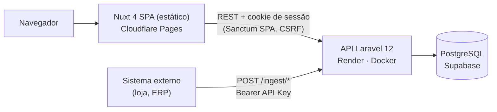
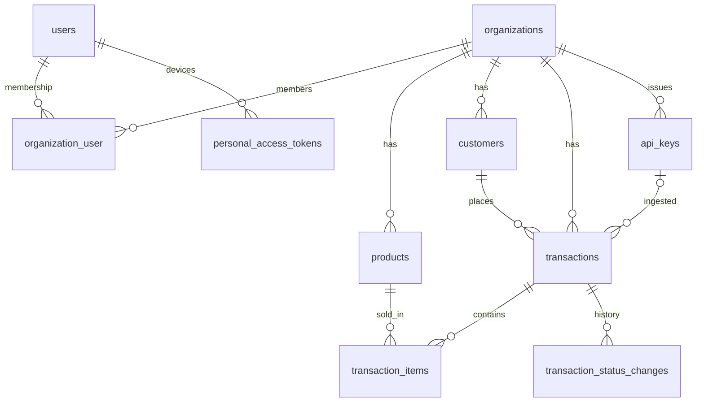

# Arquitetura e decisões técnicas

Este documento explica **por que** o PulseBoard é construído do jeito que é. Visão geral no [README](../README.md); contratos da API em [`api.md`](api.md).

## Visão geral



Monorepo com dois apps independentes, sem código compartilhado:

- `apps/api` — API REST em Laravel 12 (PHP 8.4). Toda regra de negócio e todo cálculo de métrica vivem aqui.
- `apps/web` — SPA em Nuxt 4 gerada estaticamente. Apresenta os dados; não recalcula métricas.

Os tipos TypeScript do front espelham os contratos da API de forma deliberada e enxuta, a partir de respostas reais (em vez de um pacote compartilhado ou geração de código, que não se pagariam com dois apps).

## Modelo de dados



- UUID como chave primária em todas as tabelas de domínio.
- Dinheiro em `decimal(12,2)`; moeda em `organizations.currency` (BRL).
- `organizations.timezone` (IANA, padrão `America/Sao_Paulo`) define o calendário de negócio; timestamps sempre em UTC.
- `transaction_items.unit_price` e `line_total` guardam o preço **no momento da venda** — mudar o preço do produto não reescreve o histórico.
- Produtos e clientes com histórico recebem soft delete; SKU e e-mail continuam únicos por organização, incluindo registros removidos.
- `external_id` (nullable) em clientes, produtos e transações: o ID do registro no sistema integrado, com `UNIQUE (organization_id, external_id)` nas três tabelas (NULLs não conflitam). Em `transactions`, esse índice é a garantia de idempotência da ingestão.
- `transactions.source` (`seed` ou `ingest`) indica a origem; `transactions.api_key_id` registra qual chave criou a transação.
- `transactions.status` é o estado atual, denormalizado para o analytics; `transaction_status_changes` guarda a cadeia completa de mudanças, com `UNIQUE (transaction_id, to_status)`.
- `api_keys` guarda o `prefix` público (único) e só o `secret_hash` (SHA-256), nunca a chave.
- `personal_access_tokens` (Sanctum) guarda os tokens dos clientes nativos: `tokenable_id` UUID (`uuidMorphs`, porque `users` usa UUID), `name` = dispositivo, só o SHA-256 do token e `expires_at`.

## Autenticação: sessão no web, token no mobile

A API interna tem dois clientes com necessidades diferentes, e cada um usa o mecanismo do Sanctum feito para ele. Depois de autenticar, o caminho é o mesmo: `EnsureOrganizationContext` e as Policies usam `$request->user()`, que funciona igual para sessão ou token.

| Cliente | Credencial | Por quê |
|---------|-----------|---------|
| **Web (navegador)** | **Sessão em cookie httpOnly + CSRF** | O navegador guarda o cookie fora do alcance do JavaScript: um XSS não lê a credencial |
| **Mobile (nativo)** | **Personal Access Token, 30 dias, um por dispositivo** | Fora do navegador não há cookie jar, CSRF e `SameSite` confiáveis; o app guarda o token no Keychain/Keystore |

### Web: Sanctum SPA

| Abordagem | Segurança | Observação |
|-----------|-----------|------------|
| Bearer token no `localStorage` | Fraca — qualquer XSS lê o token | Simples, mas é o padrão que se quer evitar |
| Bearer token só em memória | Melhor, mas a sessão some no refresh | UX ruim |
| **Sanctum SPA (sessão em cookie httpOnly + CSRF)** | **Credencial inacessível ao JavaScript** | **Escolhida** — fluxo oficial do Laravel para SPAs |
| BFF / proxy que guarda o token | Isolamento máximo | Uma camada a mais de deploy sem ganho proporcional aqui |

Como funciona:

1. o front chama `GET /sanctum/csrf-cookie` (com `credentials: 'include'`);
2. `POST /auth/login` cria a sessão; o cookie é `httpOnly`, `Secure`, `SameSite=Lax`;
3. mutações enviam o `XSRF-TOKEN` no header `X-XSRF-TOKEN`; o client do front busca o cookie sob demanda e repete a requisição uma vez em 419;
4. Pinia guarda apenas o estado de UI (usuário e organização), nunca a credencial.

**Consequência de deploy:** o cookie só é enviado e o `XSRF-TOKEN` só é legível se front e API estiverem no **mesmo site**. Subdomínios padrão das plataformas (`*.pages.dev`, `*.onrender.com`) estão na Public Suffix List e são sites diferentes; por isso a produção usa `app.henriqueverri.dev` e `api.henriqueverri.dev` com `SESSION_DOMAIN=.henriqueverri.dev`. A alternativa seria um proxy same-origin — mais peças para o mesmo resultado.

Outros controles:

- CORS com a origem exata do front e `supports_credentials` (nunca `*`);
- throttle de 6 requisições por minuto em login e cadastro;
- erros em `api/*` sempre em JSON, sem expor nomes de classe (404 genérico para model inexistente);
- `TRUSTED_PROXIES` para que, atrás do proxy do Render, a API veja HTTPS e o IP real (o rate limit depende disso);
- `?redirect=` pós-login aceita apenas caminhos internos;
- headers do front: `X-Frame-Options: DENY`, `frame-ancestors 'none'`, `Permissions-Policy`.

### Mobile: Personal Access Token

| Alternativa | Por que não |
|-------------|-------------|
| Cookie/sessão no app nativo | Cookie jar nativo, CSRF e `SameSite` são frágeis fora do navegador |
| Passport / OAuth2 | Um servidor de autorização inteiro para um cliente first-party |
| JWT próprio | Reimplementa o que o Sanctum já faz, com revogação mais difícil |
| Refresh token | O Sanctum não tem; exigiria rotação, detecção de reuso e armazenamento extra. 30 dias + novo login bastam para o uso |
| **PAT do Sanctum** | **Escolhido:** revogável na hora (linha no banco, só o SHA-256), expiração por token, mesmo guard `auth:sanctum` das rotas internas |

Como funciona:

1. `POST /auth/tokens` com e-mail, senha e `device_name` valida as credenciais pelo provider (o mesmo timebox do login), **sem iniciar sessão**, e devolve o token uma única vez;
2. um token por dispositivo: emitir de novo para o mesmo `device_name` apaga o anterior; dispositivos diferentes coexistem; os tokens expirados do usuário são apagados na emissão (não há scheduler no Render Free para `sanctum:prune-expired`);
3. o app manda `Authorization: Bearer <id>|pbm_<segredo>` e `X-Organization-Id`; sem `Origin`/`Referer` de navegador, a requisição não é stateful (sem sessão nem CSRF);
4. logout revoga o token (`DELETE /auth/tokens/current`, ou `POST /auth/logout`, que com token revoga em vez de mexer em sessão).

Por que o web não muda: o Sanctum tenta primeiro o guard de sessão (`sanctum.guard = ['web']`) e só depois o Bearer, então uma sessão válida continua valendo mesmo com um Bearer inválido junto. O prefixo `pbm_` (`SANCTUM_TOKEN_PREFIX`) serve ao secret scanning e distingue o token da API Key `pb_`.

Trade-offs aceitos: o Sanctum grava `last_used_at` a cada requisição com token (uma escrita por request, aceitável no volume atual); tokens sem abilities (`['*']`) — restringir o mobile a leitura exigiria checagem em todas as rotas e fica como evolução; as contas da demo são compartilhadas, então o app gera um `device_name` com sufixo aleatório para visitantes não derrubarem o token uns dos outros, e `pulseboard:demo --refresh` apaga os tokens dessas contas.

## Multi-tenancy

Banco compartilhado com `organization_id` em toda tabela de domínio e membership em `organization_user` (papéis `owner` e `member`). Escolhido por ser simples de operar e suficiente para o volume esperado; o isolamento é garantido em camadas:

1. **Contexto:** o header `X-Organization-Id` apenas seleciona a organização. Sem header ou com UUID inválido → 400.
2. **Membership:** o middleware `EnsureOrganizationContext` valida que o usuário pertence à organização (senão 403) e registra a `CurrentOrganization` no container.
3. **Escopo de dados:** listagens partem da organização do contexto (`$organization->products()`), e o route model binding do trait `BelongsToOrganization` só resolve registros da organização atual — recurso de outra organização é indistinguível de inexistente (404).
4. **Integridade:** os models recusam transação com cliente de outra organização e item com produto de outra organização.
5. **Autorização:** Policies por papel — por exemplo, só `owner` exclui produtos e clientes.

`organization_id` enviado no payload ou na query é rejeitado com 422: o tenant nunca vem do cliente. No front, a organização ativa é lembrada num cookie (apenas o UUID, validado contra `/auth/me`) e trocar de organização descarta todo o cache de dados.

Testes dedicados (`ApiTenantIsolationTest`, `AnalyticsTenantIsolationTest`, `TenantIsolationTest`) garantem que dados de uma organização nunca aparecem em outra — nem como linhas, nem alterando números agregados.

## Analytics

**Tudo é agregado no backend, em SQL.** O front recebe números prontos, então dashboard, rankings e detalhes nunca divergem entre si.

- **Uma definição de venda:** receita, pedidos, ticket médio e clientes ativos consideram só transações `paid` (`Transaction::scopePaid()`). A distribuição por status é a única exceção, e é documentada.
- **Um service por endpoint** (`app/Services/Analytics`); Revenue, Products e Customers reutilizam os KPIs do `DashboardService`, então o resumo de cada tela é, por construção, o mesmo número do dashboard.
- **Comparação com o período anterior** de mesma duração em todas as métricas (`value`, `previous`, `change`), lida na mesma varredura do período atual (`CASE` sobre o intervalo contíguo anterior + atual).
- **Dinheiro como string decimal** (`"1250.00"`) na API; o front formata com `Intl` na moeda da organização. Nada de float para valores monetários.
- **Número fixo de consultas por endpoint** (Dashboard 1, Revenue 2, Products 3, Customers 4, Status 1), independente de volume, `limit`, granularidade ou tamanho do período. `AnalyticsQueryBudgetTest` trava esses limites.
- **Consistência entre endpoints testada** (`AnalyticsCrossEndpointConsistencyTest`): receita do dashboard = soma da série = soma do ranking completo de produtos = linha `paid` do status; pedidos batem com a listagem de transações; o `previous` de cada métrica é igual ao `value` de uma consulta ao período anterior.

### Performance

Medido com `EXPLAIN ANALYZE` no PostgreSQL 16, num banco descartável com 200 mil transações e 500 mil itens (organização principal com 120 mil transações em 2 anos), com consultas capturadas de requisições reais:

- **30 dias:** de ~2 a ~45 ms por consulta, via bitmap scan em `transactions (organization_id, occurred_at)`.
- **366 dias:** até ~300 ms no resumo de produtos, dominado pelo `COUNT(DISTINCT)` com `work_mem` padrão, não pelo acesso a índice.
- **Listagem de transações:** < 3 ms.

O índice candidato `(organization_id, status, occurred_at)` foi medido antes e depois e **descartado**: sem ganho material nas analytics (o gargalo em períodos longos é o sort), com custo de espaço e escrita. Para organizações muito maiores, o caminho seria pré-agregação ou cache, não esse índice.

## Ingestão de transações

Sistemas externos enviam vendas pela API de ingestão (`/api/v1/ingest/*`), uma transação por requisição, de forma síncrona. Contrato e guia do integrador em [`integration.md`](integration.md).

```mermaid
sequenceDiagram
  participant Ext as Sistema externo
  participant MW as AuthenticateApiKey
  participant Req as IngestTransactionRequest
  participant Svc as TransactionIngestionService
  participant DB as PostgreSQL
  Ext->>MW: POST /ingest/transactions (Bearer pb_...)
  MW->>DB: api_keys por prefix; sha256 comparado com hash_equals
  MW->>MW: registra CurrentOrganization e a chave no request
  MW->>Req: validação de formato (sem banco)
  Req->>Svc: payload normalizado + fingerprint
  Svc->>DB: BEGIN; produtos por SKU (um whereIn); cliente por external_id ou insert
  Svc->>DB: INSERT transaction (unique organization_id + external_id)
  alt violação da unique
    DB-->>Svc: 23505, ROLLBACK
    Svc->>DB: lê a existente e compara o fingerprint
    Svc-->>Ext: 200 replay ou 409 transaction_conflict
  else inserida
    Svc->>DB: INSERT dos itens (multi-row) + status change; COMMIT
    Svc-->>Ext: 201 Created
  end
```

### Duas superfícies de autenticação

| | API interna (web e mobile) | API de ingestão (sistemas externos) |
|---|---|---|
| Credencial | Sessão Sanctum em cookie httpOnly + CSRF (web) ou Personal Access Token do usuário (mobile) | `Authorization: Bearer` com API Key |
| Organização | Header `X-Organization-Id`, validado contra a membership | A própria chave; o header é ignorado |
| Autorização | Policies por papel (owner/member) | Chave válida e da organização; não há usuário |
| Rate limit | Login, cadastro e emissão de token | 120 req/min por chave |

As duas não se misturam: o Bearer da integração nas rotas internas recebe 401 (a chave `pb_…` não tem o formato `<id>|<segredo>` do Sanctum e não corresponde a nenhum hash de `personal_access_tokens`), e nem a sessão nem o PAT autenticam a ingestão (`invalid_api_key`). O middleware da chave registra o mesmo `CurrentOrganization` da API interna, então escopos de tenant, bindings e services são reaproveitados sem código novo.

### API Keys

| Alternativa | Por que não |
|-------------|-------------|
| Tokens do Sanctum | O guard `auth:sanctum` das rotas internas aceitaria o token como se fosse um usuário: a credencial de integração vazaria para a superfície interna |
| JWT | Não se revoga sem uma denylist, não registra uso e não carrega nada de que a ingestão precise |
| **Chave opaca com lookup no banco** | **Escolhida:** revogação instantânea, `last_used_at`, prefixo público para logs e UI |

- **Formato `pb_<prefix>_<secret>`:** 12 caracteres públicos (identificam a chave sem expor o segredo) e 40 de segredo, cerca de 238 bits gerados com `random_bytes`. O prefixo `pb_` permite secret scanning.
- **SHA-256, não bcrypt:** com essa entropia não há brute force viável, e um hash lento custaria dezenas de milissegundos em toda requisição sem proteger nada. Bcrypt existe para senhas de baixa entropia. A comparação usa `hash_equals`.
- **Exibida uma vez:** só a resposta do `POST /api-keys` (com `Cache-Control: no-store`) traz o texto puro. O front a mantém só na memória do componente, nunca em cache, store, storage ou URL, e a descarta ao fechar o diálogo.
- **Revogação sem exclusão:** `revoked_at` mantém a linha para auditoria e para o vínculo `transactions.api_key_id`.
- **401 genérico:** chave ausente, malformada, desconhecida, com segredo errado, revogada ou expirada recebem a mesma resposta; o motivo real vai só para o log (com o prefixo, nunca o segredo).
- **Owner cria e revoga, member só vê;** no máximo 10 ativas por organização, com a contagem serializada por lock na organização.
- **Demo sem chave pública:** nenhuma chave é criada pelo seed, pelo `pulseboard:demo` ou pelo deploy. Quem testa a demo cria a própria, e na organização de demo toda chave expira em 24 horas; o `--refresh` apaga as chaves e as transações ingeridas.

### Idempotência e concorrência

- **Chave natural, não header:** o `external_id` da venda, com `UNIQUE (organization_id, external_id)`. Um `Idempotency-Key` separado seria uma segunda fonte de verdade para o mesmo recurso. O escopo é a organização, não a chave, para que trocar de chave não abra brecha para duplicatas.
- **Insert-first:** o service tenta o `INSERT` direto, sem `SELECT` antes. Retry e corrida percorrem o mesmo caminho: a violação da unique. Depois do rollback (no PostgreSQL, um erro aborta a transação inteira), a existente é lida e o fingerprint decide entre **200** (`Idempotent-Replayed: true`) e **409** `transaction_conflict`.
- **Fingerprint:** SHA-256 do payload canônico (`external_id`, `occurred_at` em UTC, moeda, status inicial, `customer.external_id` e itens ordenados por SKU, com quantidade e centavos). Nome e e-mail do cliente ficam de fora porque nunca alteram um cliente existente.
- **Na corrida,** a requisição B bloqueia no índice único até A fazer commit e então recebe a violação, caindo no replay; se A fizer rollback, B é inserida. Nenhum lock explícito é necessário na criação.
- **Cliente novo concorrente:** `createOrFirst` com savepoint. Uma violação no `external_id` relê o existente; uma violação no e-mail com outro `external_id` vira 409 `customer_email_conflict` e nada é persistido.
- **Fronteira transacional:** começa depois da validação de formato (que não segura conexão) e termina no insert do status change; uma falha no meio não deixa cliente órfão.
- **Dinheiro sem float:** os valores chegam como string decimal e são convertidos direto para centavos; número JSON é rejeitado. O total é calculado no servidor; o `total_amount` enviado serve só de conferência (422 `total_mismatch`).

`IngestConcurrencyTest` (só no PostgreSQL, com conexões e commits concorrentes de verdade) prova que requisições simultâneas com o mesmo `external_id` geram uma única transação.

### Lifecycle da transação

```text
pending ──► paid ──► refunded
   │
   └──────► canceled
```

- **A máquina de estados vive no enum** (`TransactionStatus::canTransitionTo()`, `isFinal()`, `allowedOnCreate()`): a ingestão cria só `pending` ou `paid`; estorno e cancelamento são transições posteriores.
- **`TransactionLifecycle`** é o único lugar que muda status depois da criação: `lockForUpdate` na transação, valida a transição e a cronologia (`occurred_at` não pode ser anterior à mudança anterior), atualiza `transactions.status` e grava o status change na mesma transação de banco. O lock explícito existe só aqui, porque é o único read-modify-write.
- **Status denormalizado + histórico:** o analytics lê `transactions.status` (barato); o histórico serve para auditoria e para a linha do tempo da UI. Os testes de criação, de transição e do backfill verificam que o status atual é sempre o fim da cadeia do histórico.
- **O banco também protege a máquina:** como nenhum estado é revisitado, `UNIQUE (transaction_id, to_status)` impede uma transição duplicada mesmo que o lock falhe.
- **Ordem do histórico pela cadeia,** a partir de `from_status: null`, e não por timestamp: duas mudanças podem ter o mesmo `occurred_at` (é o caso do backfill dos dados antigos).
- **Mudança de status como recurso** (`POST …/status-changes`), não `PATCH` no campo: 201 aplicada, 200 se já está no status pedido, 409 `invalid_transition`.

### Síncrono, não assíncrono

Uma transação é processada em poucos milissegundos, e o integrador precisa da resposta (201, 200 ou 409) para decidir se repete. Uma fila exigiria um worker (o Render Free não tem) e devolveria 202 sem garantia de processamento, o que pioraria a semântica de idempotência para quem integra. O gatilho concreto para processamento assíncrono seria um endpoint de lote ou importação de CSV; o driver de fila em banco já está configurado.

### Observabilidade e limites

- **`X-Request-Id`** em toda resposta de `api/*` (aceita o do cliente, se bem formado, ou gera um UUID) e em todas as linhas de log da requisição, via `Log::shareContext`.
- **Uma linha de log por requisição de ingestão** (`event` `ingest.transaction` ou `ingest.status_change`), com `outcome` (`created`, `replayed`, `conflict`, `rejected`, `transitioned`), organização, chave (id e prefixo), `external_id`, `http_status`, `code` e `duration_ms`. Falhas de autenticação saem em `warning` com o motivo. Nunca são logados a chave, o header `Authorization`, o hash, o payload inteiro nem dados pessoais do cliente.
- **Logs em JSON em produção** (`LOG_STDERR_FORMATTER`), um objeto por linha, filtráveis por `request_id`, `event` ou `code` no painel do Render.
- **Roteiro de investigação:** o integrador informa o `request_id` ou o `external_id`; o log mostra o resultado e o `code`; a transação aparece na busca da UI pelo `external_id`, com a linha do tempo de status; o `last_used_at` da chave completa o quadro.
- **Número fixo de consultas na criação,** independente do número de itens: chave, produtos num único `whereIn`, cliente, insert da transação, um insert multi-row dos itens e o status change. `IngestQueryBudgetTest` compara 1 e 100 itens.
- **Limites:** 120 req/min por chave (rate limiter no cache em banco, 429 com `Retry-After`), 100 itens por transação, 2 MB de corpo no Nginx.

## Timezone

"Hoje", "este mês" e "semana passada" dependem de onde o negócio está, não de onde o servidor roda.

- O banco guarda UTC. O cliente nunca escolhe a timezone: ela vem sempre de `organizations.timezone`.
- `from` / `to` são datas locais da organização; os limites (00:00 de `from` até 24:00 de `to`) são calculados na aplicação (`ReportingPeriod`) e convertidos para UTC antes da consulta.
- Os buckets de dia, semana ISO e mês da série de receita são agrupados no fuso local pelo PostgreSQL (`AT TIME ZONE`), com horário de verão correto. Exemplo: uma venda em `2026-09-01T02:59:59Z` pertence a 31/08 em `America/Sao_Paulo`.
- O front calcula presets de período com a data de hoje **no fuso da organização** e exibe datas e horários nesse fuso.
- A suíte local roda em SQLite, que não tem base de timezones; os 2 testes de DST dos buckets rodam no PostgreSQL, que é o banco da CI.

## Frontend

```text
página/componente → composable → repository → useApiClient
```

- **SPA estática** (`ssr: false`): a sessão é um cookie da API, então renderizar no servidor não agregaria nada e exigiria um servidor Node. O build vai para uma CDN.
- **`useApiClient`** centraliza credenciais, header de organização, CSRF, retry em 419 e normalização de erros (401 → login com `redirect`, 422 → erros por campo).
- **Estado na URL:** filtros, paginação, período, granularidade, ordenação e limite vivem na query string — links compartilháveis e voltar/avançar funcionam.
- **Pinia só para a sessão**; dados de tela via `useAsyncData` com chave por organização, mantendo os dados anteriores visíveis durante o refetch.
- **UI própria** sobre primitivos headless acessíveis (reka-ui) e tokens de design em CSS; gráficos com Chart.js carregados sob demanda (chunk separado do bundle inicial), cada um com tabela equivalente para leitores de tela.
- **Erros da API visíveis:** `message`, `code` e `errors` da API viram mensagens e erros por campo; 403 explica a falta de permissão, 429 respeita o `Retry-After` e os estados de erro mostram o `X-Request-Id` para suporte.
- **Segredos:** a API Key recém-criada fica só na memória do componente do diálogo, nunca em `useAsyncData`, Pinia, storage, URL ou logs, e é descartada ao fechar.
- **Acessibilidade:** axe-core sem violações nas telas principais (390 px e 1440 px), e a página de API Keys verificada pelo E2E a cada execução (desktop, mobile e diálogo do segredo aberto); Lighthouse medido localmente no build estático com 100 em acessibilidade e boas práticas.

## Infraestrutura

- **Sem Redis, filas ou workers:** nada é assíncrono hoje (inclusive a ingestão); sessão, cache e o rate limiter da ingestão ficam no banco. Menos peças para operar em planos gratuitos; o rate limiter é o primeiro ponto em que Redis passaria a se justificar com volume.
- **Logs estruturados:** `stderr` em JSON, lidos no painel do Render; sem stack de observabilidade separada.
- **Deploy pelas integrações nativas** das plataformas, sem workflow de deploy próprio: a CI valida, as plataformas publicam. A API só é publicada depois dos checks da CI.
- **Migrations no start do container**, sob advisory lock do PostgreSQL (o Render Free não tem pre-deploy command). Se falhar, o container não sobe e a versão anterior continua no ar.

Detalhes operacionais em [`deployment.md`](deployment.md).

## Limitações conhecidas

- O analytics considera o status **atual** da transação: um estorno posterior muda retroativamente o período da venda original. O histórico de status já existe; usá-lo para reconhecer o estorno na data do estorno é a próxima evolução.
- O backfill do histórico das transações antigas usa o `occurred_at` da venda como data do estorno ou cancelamento, porque a data real não existe.
- O período padrão (últimos 30 dias) inclui o dia de hoje, ainda incompleto.
- Sem cache de analytics: cada requisição consulta o banco.
- Um único ambiente (produção), sem staging.

Trade-offs aceitos na ingestão:

- Unicidade por organização: um integrador com várias origens precisa usar namespaces nos IDs (`loja:1001`).
- A ingestão nunca atualiza um cliente existente: dados divergentes ficam com a versão do PulseBoard.
- Não há vínculo automático por e-mail: o 409 `customer_email_conflict` obriga um vínculo explícito pela UI.
- Sem lote nem processamento assíncrono: volumes altos viram N requisições, sob o rate limit.
- A demo não oferece uma chave pronta: testar a ingestão exige criar a própria chave, em troca de nenhum segredo publicado.
- Os logs são a única trilha das requisições; não há tabela de log de ingestão.
- O rate limiter no cache em banco faz escritas extras por requisição, aceitável no volume da demo.
