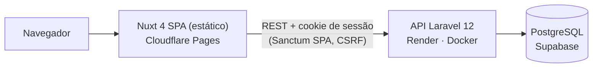
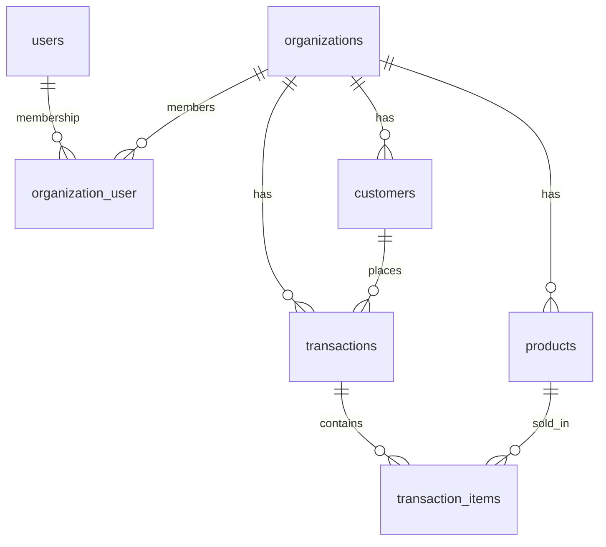

# Arquitetura e decisões técnicas

Este documento explica **por que** o PulseBoard é construído do jeito que é. Visão geral no [README](../README.md); contratos da API em [`api.md`](api.md).

## Visão geral



Monorepo com dois apps independentes, sem código compartilhado:

- `apps/api` — API REST em Laravel 12 (PHP 8.4). Toda regra de negócio e todo cálculo de métrica vivem aqui.
- `apps/web` — SPA em Nuxt 4 gerada estaticamente. Apresenta os dados; não recalcula métricas.

Os tipos TypeScript do front espelham os contratos da API de forma deliberada e enxuta, a partir de respostas reais (em vez de um pacote compartilhado ou geração de código, que não se pagariam com dois apps).

## Modelo de dados



- UUID como chave primária em todas as tabelas de domínio.
- Dinheiro em `decimal(12,2)`; moeda em `organizations.currency` (BRL).
- `organizations.timezone` (IANA, padrão `America/Sao_Paulo`) define o calendário de negócio; timestamps sempre em UTC.
- `transaction_items.unit_price` e `line_total` guardam o preço **no momento da venda** — mudar o preço do produto não reescreve o histórico.
- Produtos e clientes com histórico recebem soft delete; SKU e e-mail continuam únicos por organização, incluindo registros removidos.

## Autenticação: Sanctum SPA

| Abordagem | Segurança | Observação |
|-----------|-----------|------------|
| Bearer token no `localStorage` | Fraca — qualquer XSS lê o token | Simples, mas é o padrão que se quer evitar |
| Bearer token só em memória | Melhor, mas a sessão some no refresh | UX ruim |
| **Sanctum SPA (sessão em cookie httpOnly + CSRF)** | **Credencial inacessível ao JavaScript** | **Escolhida** — fluxo oficial do Laravel para SPAs |
| BFF / proxy que guarda o token | Isolamento máximo | Uma camada a mais de deploy sem ganho proporcional aqui |

Como funciona:

1. o front chama `GET /sanctum/csrf-cookie` (com `credentials: 'include'`);
2. `POST /auth/login` cria a sessão; o cookie é `httpOnly`, `Secure`, `SameSite=Lax`;
3. mutações enviam o `XSRF-TOKEN` no header `X-XSRF-TOKEN`; o client do front busca o cookie sob demanda e repete a requisição uma vez em 419;
4. Pinia guarda apenas o estado de UI (usuário e organização), nunca a credencial.

**Consequência de deploy:** o cookie só é enviado e o `XSRF-TOKEN` só é legível se front e API estiverem no **mesmo site**. Subdomínios padrão das plataformas (`*.pages.dev`, `*.onrender.com`) estão na Public Suffix List e são sites diferentes; por isso a produção usa `app.henriqueverri.dev` e `api.henriqueverri.dev` com `SESSION_DOMAIN=.henriqueverri.dev`. A alternativa seria um proxy same-origin — mais peças para o mesmo resultado.

Outros controles:

- CORS com a origem exata do front e `supports_credentials` (nunca `*`);
- throttle de 6 requisições por minuto em login e cadastro;
- erros em `api/*` sempre em JSON, sem expor nomes de classe (404 genérico para model inexistente);
- `TRUSTED_PROXIES` para que, atrás do proxy do Render, a API veja HTTPS e o IP real (o rate limit depende disso);
- `?redirect=` pós-login aceita apenas caminhos internos;
- headers do front: `X-Frame-Options: DENY`, `frame-ancestors 'none'`, `Permissions-Policy`.

## Multi-tenancy

Banco compartilhado com `organization_id` em toda tabela de domínio e membership em `organization_user` (papéis `owner` e `member`). Escolhido por ser simples de operar e suficiente para o volume esperado; o isolamento é garantido em camadas:

1. **Contexto:** o header `X-Organization-Id` apenas seleciona a organização. Sem header ou com UUID inválido → 400.
2. **Membership:** o middleware `EnsureOrganizationContext` valida que o usuário pertence à organização (senão 403) e registra a `CurrentOrganization` no container.
3. **Escopo de dados:** listagens partem da organização do contexto (`$organization->products()`), e o route model binding do trait `BelongsToOrganization` só resolve registros da organização atual — recurso de outra organização é indistinguível de inexistente (404).
4. **Integridade:** os models recusam transação com cliente de outra organização e item com produto de outra organização.
5. **Autorização:** Policies por papel — por exemplo, só `owner` exclui produtos e clientes.

`organization_id` enviado no payload ou na query é rejeitado com 422: o tenant nunca vem do cliente. No front, a organização ativa é lembrada num cookie (apenas o UUID, validado contra `/auth/me`) e trocar de organização descarta todo o cache de dados.

Testes dedicados (`ApiTenantIsolationTest`, `AnalyticsTenantIsolationTest`, `TenantIsolationTest`) garantem que dados de uma organização nunca aparecem em outra — nem como linhas, nem alterando números agregados.

## Analytics

**Tudo é agregado no backend, em SQL.** O front recebe números prontos, então dashboard, rankings e detalhes nunca divergem entre si.

- **Uma definição de venda:** receita, pedidos, ticket médio e clientes ativos consideram só transações `paid` (`Transaction::scopePaid()`). A distribuição por status é a única exceção, e é documentada.
- **Um service por endpoint** (`app/Services/Analytics`); Revenue, Products e Customers reutilizam os KPIs do `DashboardService`, então o resumo de cada tela é, por construção, o mesmo número do dashboard.
- **Comparação com o período anterior** de mesma duração em todas as métricas (`value`, `previous`, `change`), lida na mesma varredura do período atual (`CASE` sobre o intervalo contíguo anterior + atual).
- **Dinheiro como string decimal** (`"1250.00"`) na API; o front formata com `Intl` na moeda da organização. Nada de float para valores monetários.
- **Número fixo de consultas por endpoint** (Dashboard 1, Revenue 2, Products 3, Customers 4, Status 1), independente de volume, `limit`, granularidade ou tamanho do período. `AnalyticsQueryBudgetTest` trava esses limites.
- **Consistência entre endpoints testada** (`AnalyticsCrossEndpointConsistencyTest`): receita do dashboard = soma da série = soma do ranking completo de produtos = linha `paid` do status; pedidos batem com a listagem de transações; o `previous` de cada métrica é igual ao `value` de uma consulta ao período anterior.

### Performance

Medido com `EXPLAIN ANALYZE` no PostgreSQL 16, num banco descartável com 200 mil transações e 500 mil itens (organização principal com 120 mil transações em 2 anos), com consultas capturadas de requisições reais:

- **30 dias:** de ~2 a ~45 ms por consulta, via bitmap scan em `transactions (organization_id, occurred_at)`.
- **366 dias:** até ~300 ms no resumo de produtos, dominado pelo `COUNT(DISTINCT)` com `work_mem` padrão, não pelo acesso a índice.
- **Listagem de transações:** < 3 ms.

O índice candidato `(organization_id, status, occurred_at)` foi medido antes e depois e **descartado**: sem ganho material nas analytics (o gargalo em períodos longos é o sort), com custo de espaço e escrita. Para organizações muito maiores, o caminho seria pré-agregação ou cache, não esse índice.

## Timezone

"Hoje", "este mês" e "semana passada" dependem de onde o negócio está, não de onde o servidor roda.

- O banco guarda UTC. O cliente nunca escolhe a timezone: ela vem sempre de `organizations.timezone`.
- `from` / `to` são datas locais da organização; os limites (00:00 de `from` até 24:00 de `to`) são calculados na aplicação (`ReportingPeriod`) e convertidos para UTC antes da consulta.
- Os buckets de dia, semana ISO e mês da série de receita são agrupados no fuso local pelo PostgreSQL (`AT TIME ZONE`), com horário de verão correto. Exemplo: uma venda em `2026-09-01T02:59:59Z` pertence a 31/08 em `America/Sao_Paulo`.
- O front calcula presets de período com a data de hoje **no fuso da organização** e exibe datas e horários nesse fuso.
- A suíte local roda em SQLite, que não tem base de timezones; os 2 testes de DST dos buckets rodam no PostgreSQL, que é o banco da CI.

## Frontend

```text
página/componente → composable → repository → useApiClient
```

- **SPA estática** (`ssr: false`): a sessão é um cookie da API, então renderizar no servidor não agregaria nada e exigiria um servidor Node. O build vai para uma CDN.
- **`useApiClient`** centraliza credenciais, header de organização, CSRF, retry em 419 e normalização de erros (401 → login com `redirect`, 422 → erros por campo).
- **Estado na URL:** filtros, paginação, período, granularidade, ordenação e limite vivem na query string — links compartilháveis e voltar/avançar funcionam.
- **Pinia só para a sessão**; dados de tela via `useAsyncData` com chave por organização, mantendo os dados anteriores visíveis durante o refetch.
- **UI própria** sobre primitivos headless acessíveis (reka-ui) e tokens de design em CSS; gráficos com Chart.js carregados sob demanda (chunk separado do bundle inicial), cada um com tabela equivalente para leitores de tela.
- **Acessibilidade:** axe-core sem violações nas telas principais (390 px e 1440 px); Lighthouse medido localmente no build estático com 100 em acessibilidade e boas práticas.

## Infraestrutura

- **Sem Redis, filas ou workers:** nada é assíncrono hoje; sessão e cache ficam no banco. Menos peças para operar em planos gratuitos.
- **Deploy pelas integrações nativas** das plataformas, sem workflow de deploy próprio: a CI valida, as plataformas publicam. A API só é publicada depois dos checks da CI.
- **Migrations no start do container**, sob advisory lock do PostgreSQL (o Render Free não tem pre-deploy command). Se falhar, o container não sobe e a versão anterior continua no ar.

Detalhes operacionais em [`deployment.md`](deployment.md).

## Limitações conhecidas

- O status considerado é o **atual** da transação: um estorno posterior muda retroativamente o período da venda original (não há histórico de status).
- O período padrão (últimos 30 dias) inclui o dia de hoje, ainda incompleto.
- Sem cache de analytics: cada requisição consulta o banco.
- Um único ambiente (produção), sem staging.
